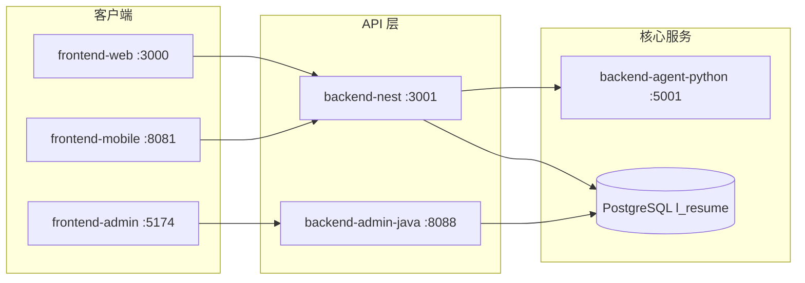

# 简流 (l-resume) 模块功能说明

> 检查日期：2026-07-09  
> 本文档说明 monorepo 各子项目职责、主要功能、启动方式及相互依赖关系。

---

## 目录总览

```
l-resume/
├── frontend-web/          前台 Web（Nuxt 4）
├── backend-nest/          前台 API（NestJS）
├── frontend-mobile/       移动端（Expo / React Native）
├── backend-agent-python/  AI Agent 服务（Python Flask）
├── backend-admin-java/    管理后台 API + 登录（Spring Boot）
├── frontend-admin/        管理后台 Web（React + Vite）
├── docs/auth-admin/       SSO 与管理后台文档
├── scripts/               运维与测试脚本
└── pom.xml                Java 后端父 POM（admin）
```

---

## 架构与依赖



| 依赖关系 | 说明 |
|---------|------|
| 所有业务数据 | 共用 PostgreSQL 数据库 `l_resume` |
| frontend-web / frontend-mobile | 调用 `backend-nest` REST API（前缀 `/api`） |
| frontend-admin | 表单登录 `backend-admin-java` 的 `POST /auth/login`，调用 `/admin/**` |
| backend-admin-java | 共用 `jf_user` 表，自行签发 JWT |
| backend-nest | 通过 `MULTIAGENT_SERVICE_URL` 代理至 Python Agent |

## 端口一览

| 服务 | 默认端口 | 技术栈 |
|------|---------|--------|
| frontend-web | 3000 | Nuxt 4 + Vue 3 + Tailwind |
| backend-nest | 3001 | NestJS 10 + Prisma |
| backend-agent-python | 5001 | Flask 3 |
| backend-admin-java | 8088 | Spring Boot 3.2 + JWT |
| frontend-admin | 5174 | React 18 + Vite 5 |
| frontend-mobile | 8081 | Expo 52 + Expo Router |
| PostgreSQL | 5432 | — |

---

## 里程碑检查结果

| 里程碑 | 模块 | 静态检查 | 运行时检查 | 结论 |
|--------|------|---------|-----------|------|
| M1 | frontend-web | `npm run build` ✅ | — | 构建通过 |
| M2 | backend-nest | `npm run build` ✅ | 登录、简历列表、模板、工作流 health、Agent 代理 ✅ | 正常 |
| M3 | frontend-mobile | `npm run typecheck` ✅ | — | 类型检查通过 |
| M4 | backend-agent-python | 语法检查 ✅ | `GET /health` 200 ✅ | 正常 |
| M5 | backend-admin-java | `mvn package` | `POST /auth/login` + `/admin/me` | 待验证 |
| M6 | frontend-admin | `npm run build` ✅ | — | 构建通过 |
| M7 | 文档 | — | — | 本文档 |

**测试账号**

| 账号 | 密码 | 角色 | 用途 |
|------|------|------|------|
| admin | admin123 | SUPER_ADMIN | 管理后台 |
| TestUser / 12345678900 | 123456 | USER | 前台 API |

---

## 1. frontend-web — 前台 Web

**路径：** `frontend-web/`  
**启动：** `npm install && npm run dev` → http://localhost:3000

### 主要页面

| 路由 | 功能 |
|------|------|
| `/` | 首页：3D 简历 Hero、产品介绍、快捷入口 |
| `/login` `/register` | 用户登录 / 注册（Nest JWT） |
| `/templates` | 模板库：浏览、筛选、预览、从模板创建简历 |
| `/resume` | 我的简历：列表、收藏、批量删除、分享 |
| `/editor/:id` | 可视化编辑器：分区编辑、主题、排版、头像上传 |
| `/preview/:id` | 简历预览与导出（PDF / 图片） |
| `/workflow/execution` | 智能工作流执行：上传简历 → AI 多步处理 → 生成结果 |
| `/workflow/designer` | 工作流设计器：拖拽节点、版本管理、测试与发布 |

### 核心能力

- **7 套简历模板**（见下文「简历模板」章节）
- **实时预览**：`ResumePreview` 按主题动态切换布局组件
- **AI 能力**：经 Nest 调用 Agent（优化、匹配分析、多版本生成、翻译等）
- **工作流引擎**：Vue Flow 可视化编排，与后端工作流 API 同步
- **国际化**：中 / 英 locale
- **主题系统**：亮 / 暗色、设计 token 统一管理

### API 代理

开发模式下 Nuxt 将 `/api/*` 代理至 `backend-nest`（默认 3001）。

---

## 2. backend-nest — 前台 API

**路径：** `backend-nest/`  
**启动：** 复制 `.env.example` → `.env`，执行 `npm run prisma:init`，再 `npm run start:dev`  
**文档：** http://localhost:3001/api-docs

### 模块与 API

| 模块 | 路径前缀 | 功能 |
|------|---------|------|
| auth | `/api/auth` | 注册、登录、profile、改密、登出 |
| resumes | `/api/resumes` | CRUD、上传解析、头像、收藏、分享链接 |
| templates | `/api/templates` | 模板列表与详情（公开） |
| workflows | `/api/workflows` | 工作流 CRUD、节点库、执行、版本、health |
| ai | `/api/ai` | AI 优化、检查、改写、生成、匹配、简历对话 |
| multiagent | `/api/multiagent` | 代理至 Python Agent（capabilities、optimize、parse 等） |

### 数据模型（Prisma → PostgreSQL 表名）

| 模型 | 表名 | 说明 |
|------|------|------|
| `User` | `jf_user` | 用户（含 role / status，与管理后台共用） |
| `Resume` | `jf_resume` | 简历 JSON 数据 + 样式 + templateId |
| `Template` | `jf_resume_template` | 简历模板 |
| `Workflow` | `jf_workflow` | 工作流定义（版本化） |
| `WorkflowNode` | `jf_workflow_node` | 工作流节点 |
| `WorkflowConnection` | `jf_workflow_edge` | 工作流连线 |
| `WorkflowExecution` | `jf_workflow_step` | 工作流步骤执行日志 |
| `WorkflowExecutionRun` | `jf_workflow_run` | 工作流运行记录（幂等、并发） |
| `LlmModel` | `jf_llm_model` | 大模型配置 |
| `ResumeAiChatSession` | `jf_resume_ai_session` | 简历 AI 对话会话 |
| `ResumeAiChatMessage` | `jf_resume_ai_message` | 简历 AI 对话消息 |

重建库：`npm run prisma:reset`（删旧表 → push 结构 → 种子数据）

### 环境变量

| 变量 | 说明 |
|------|------|
| `DATABASE_URL` | PostgreSQL 连接 |
| `JWT_SECRET` | Nest 自有 JWT 签名 |
| `MULTIAGENT_SERVICE_URL` | Agent 服务地址（默认 http://localhost:5001） |

---

## 3. frontend-mobile — 移动端

**路径：** `frontend-mobile/`  
**启动：** `npm install && npm start`（Expo，默认 8081）

### 主要页面（Expo Router）

| 路由 | 功能 |
|------|------|
| `/(auth)/login` `register` | 登录 / 注册 |
| `/(tabs)/index` | 首页快捷操作 |
| `/(tabs)/resumes` | 简历列表 |
| `/(tabs)/workflow` | 工作流入口 |
| `/(tabs)/profile` | 个人中心 |
| `/templates` | 模板选择 |
| `/resume/[id]/edit` `preview` | 编辑与预览 |
| `/workflow/run` `designer` `complete` | 工作流执行与设计 |
| `/ai` | AI 能力中心（优化、匹配等） |

### 特点

- 调用真实 Nest API（`EXPO_PUBLIC_API_URL`），已移除 mock 数据
- 工作流执行通过 `workflowExecutionPoll.ts` 轮询 `/api/workflows/executions/:groupId`
- **Windows 中文路径注意**：若 Metro 报错，可用 junction `C:\jianflow-expo` → `frontend-mobile`

---

## 4. backend-agent-python — AI Agent

**路径：** `backend-agent-python/`  
**启动：** `pip install -r requirements.txt && cp .env.example .env && python src/main.py`

### Agent 角色

| Agent | 职责 |
|-------|------|
| Planner | 任务规划 |
| Analyzer | 简历 / JD 分析 |
| Writer | 内容生成 |
| Reviewer | 审核润色 |
| Optimizer | 定向优化 |
| Translator | 中英翻译 |

### 主要端点（直连 5001）

| 方法 | 路径 | 功能 |
|------|------|------|
| GET | `/health` | 健康检查 |
| GET | `/api/agents/capabilities` | 能力与工作流清单 |
| POST | `/api/agents/generate-versions` | 多模板多语言版本生成 |
| POST | `/api/agents/optimize` | 简历优化 |
| POST | `/api/agents/analyze-match` | JD 匹配度分析 |
| POST | `/api/agents/parse-resume` | 简历文件解析 |
| POST | `/api/agents/translate` | 翻译 |
| POST | `/api/agents/run-node` | 工作流单节点执行 |
| POST | `/api/agents/resume-chat-edit` | 对话式编辑 |

前台 / 移动端统一经 Nest `/api/multiagent/*` 访问。

---

## 5. backend-admin-java — 管理 API + 登录

**路径：** `backend-admin-java/`  
**启动：** `mvn spring-boot:run` → http://localhost:8088

### 认证

| 方法 | 路径 | 功能 |
|------|------|------|
| POST | `/auth/login` | 管理员登录（username/phone + password），返回 JWT；无注册 |

仅 `ADMIN`、`SUPER_ADMIN` 且状态为 `active` 的用户可登录。

### 管理 API（均需 ADMIN / SUPER_ADMIN JWT）

| 方法 | 路径 | 功能 |
|------|------|------|
| GET | `/admin/stats` | 用户统计 |
| GET | `/admin/users` | 用户分页列表（支持搜索） |
| PATCH | `/admin/users/:id/role` | 修改角色（SUPER_ADMIN） |
| PATCH | `/admin/users/:id/status` | 启用 / 禁用用户 |
| GET | `/admin/me` | 当前管理员信息 |

---

## 6. frontend-admin — 管理后台 Web

**路径：** `frontend-admin/`  
**启动：** `npm install && npm run dev` → http://localhost:5174

### 页面

| 路由 | 功能 |
|------|------|
| `/login` | 管理员表单登录 |
| `/` | Dashboard：用户统计概览 |
| `/users` | 用户管理：角色、状态 |

### 认证

- `src/auth/auth.ts` — `POST /auth/login` 换取 JWT
- token 存 sessionStorage，API 请求带 Bearer

---

## 简历模板功能说明

系统内置 **7 套** 简历模板，定义于 `frontend-web/src/components/resume/schema/templates.ts`，渲染由 `ResumePreview.vue` 按 `layoutPreset` / 专用布局组件分发。

| ID | 名称 | 适用场景 | 布局 | 主色 | 核心区块 |
|----|------|---------|------|------|---------|
| `frontendEngineer` | 高级前端工程师 | 技术岗、前端 | 专用 `ResumeLayoutFrontendEngineer` | #2563EB | 基本信息、摘要、教育、**项目**、经历、技能 |
| `modern` | 应届大学生 | 应届生、实习 | 专用 `ResumeLayoutFreshGraduate` | #3B82F6 | 技能、经历、项目、教育、**证书**、**校园活动** |
| `creative` | 创意设计师 | 设计岗 | 组合布局 `creative` | #EC4899 | 经历、作品集 **portfolio** |
| `data` | 数据分析师 | 数据岗 | 组合布局 `data`（含统计条） | #10B981 | 技能、**数据项目**、证书 |
| `amber` | 产品经理 | 产品岗 | 专用 `ResumeLayoutProductManager` | #F59E0B | 技能、经历、项目、**产品成果** |
| `purple` | 学术研究者 | 科研岗 | 经典单栏 `classic` | #8B5CF6 | 项目、**论文发表 publications** |
| `developer` | 程序开发 | 通用开发 | 专用 `ResumeLayoutDeveloper` | #4A9B8E | 双栏：侧栏技能/教育，主栏经历/项目/**开源** |

### 布局预设（layoutPresets）

| preset | 结构 | 特点 |
|--------|------|------|
| `classic` | 单栏 | 头像顶栏，简洁专业 |
| `modern` | 双栏 | 侧栏技能/教育，强调分区标签 |
| `creative` | 单栏 | 创意 banner 头图 |
| `data` | 统计栏 + 内容 | 顶部数据指标条 |
| `developer` | 双栏 | 技术风头部，侧栏技能/开源 |

### 模板相关功能链路

1. **模板库**（`/templates`）— 浏览、筛选（简洁/专业/创意/开发）、弹窗预览  
2. **从模板创建** — 写入默认 `components` 顺序与 `defaultHiddenSections`  
3. **编辑器** — 按模板 schema 展示可编辑分区  
4. **AI 工作流** — `generate-versions` 可一次输出多模板版本  
5. **导出** — PDF / 图片，尊重纸张尺寸与边距设置  

---

## 快速启动（完整链路）

```bash
# 1. 数据库
cd backend-nest && cp .env.example .env && npm run prisma:init

# 2. 核心服务（各开终端）
cd backend-admin-java && mvn spring-boot:run
cd backend-agent-python && python src/main.py
cd backend-nest && npm run start:dev

# 3. 前端
cd frontend-web && npm run dev
cd frontend-admin && npm run dev
cd frontend-mobile && npm start
```

## 已知限制

1. **Windows 中文路径**：Expo Metro 可能异常，建议使用 junction 到英文路径  
2. **Agent 依赖**：必须配置 `ZHIPU_API_KEY`；模型、QPS、API 地址等统一见 `backend-nest/config/llm-models.json`  
3. **PostgreSQL**：本地需启动 `postgresql-x64-17` 服务  

---

## 相关文档

- [README.md](./README.md) — 项目概览
- [docs/auth-admin/](./docs/auth-admin/) — 管理后台 JWT 说明
- [backend-agent-python/README.md](./backend-agent-python/README.md) — Agent 环境变量
