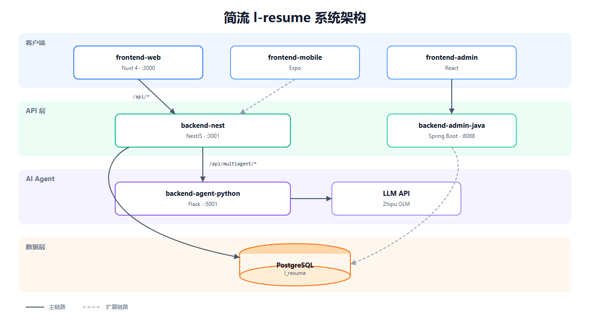
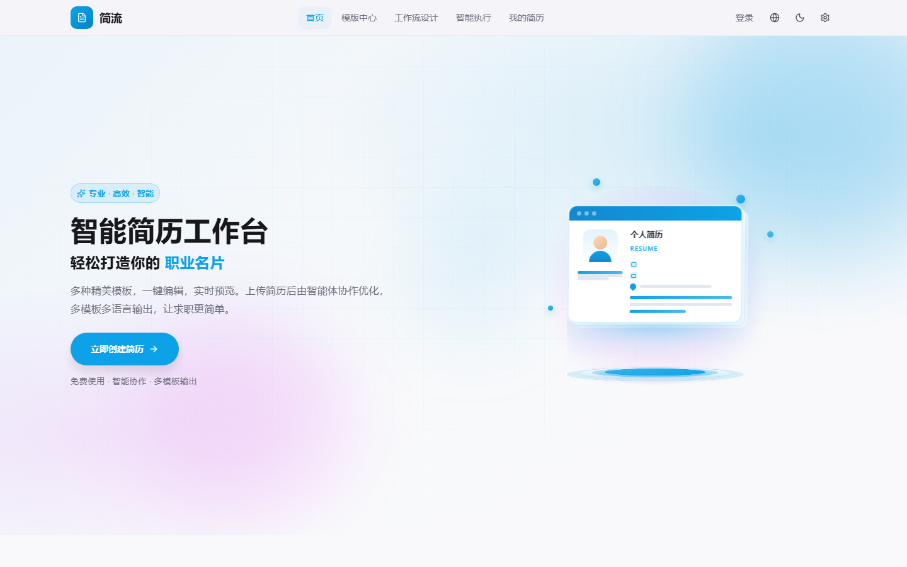
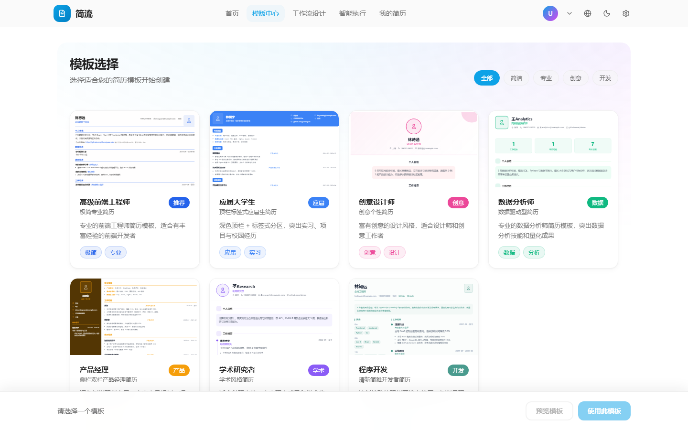
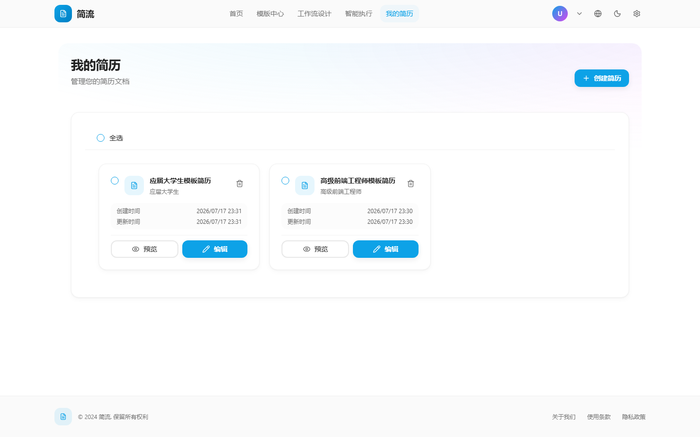
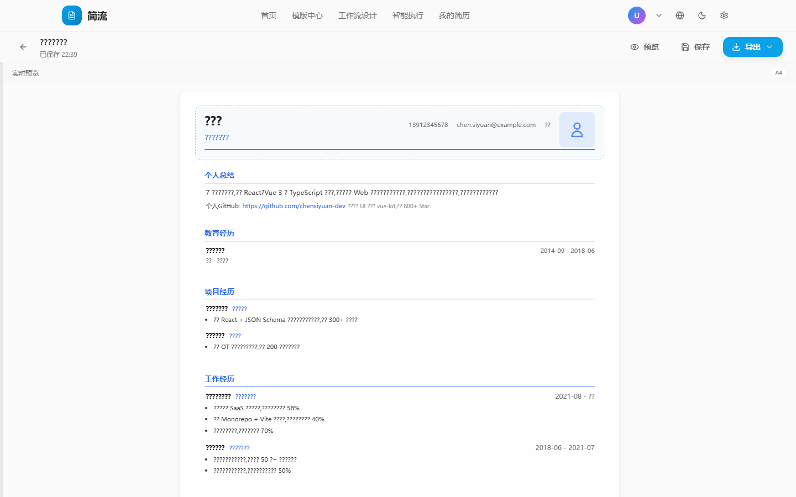
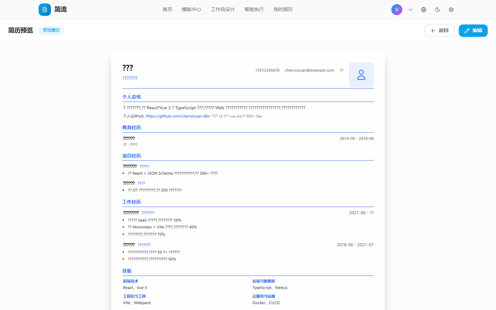
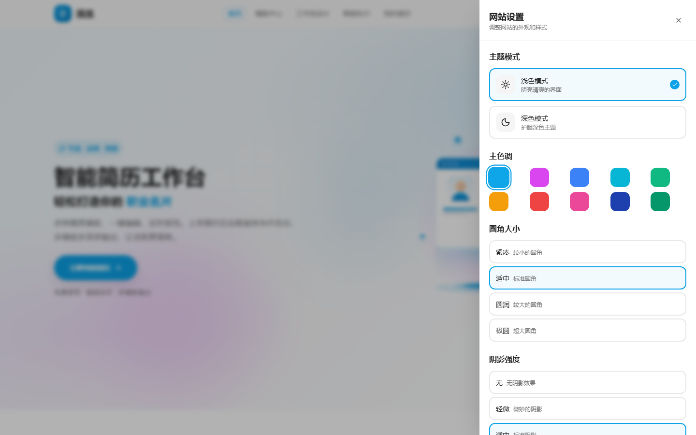
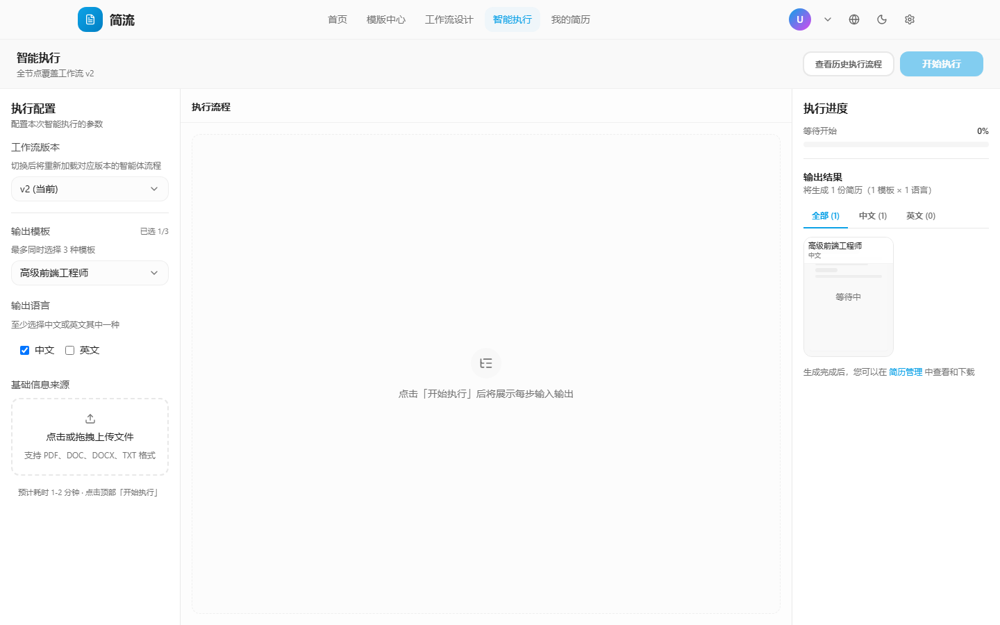
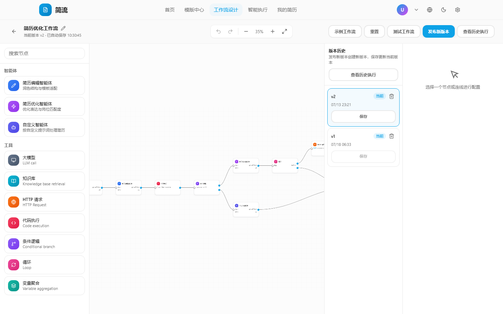

# 简流 (l-resume)

[English](./README.en.md)

智能简历工作台 — 通过可视化工作流与多智能体协作，完成简历解析、优化、多模板多语言输出。

---

## 架构总览



**请求链路**

1. 浏览器访问 `frontend-resume-nuxt`（`:3000`）
2. Nuxt 将 `/api/*` 代理到 `backend-resume-nest`（`:3001`）
3. 业务数据读写 PostgreSQL；AI 相关能力经 Nest 转发到 Agent（`:5001`）
4. Agent 按 `backend-resume-nest/config/llm-models.json` 配置调用大模型

---

## 目录结构

```
l-resume/
├── frontend-resume-nuxt/      # ✅ 前台 Web（Nuxt 4）
├── backend-resume-nest/       # ✅ 前台 API（NestJS）
├── backend-agent-python/      # ✅ AI Agent（Python Flask :5001）
├── backend-admin-spring/      # 🚧 管理后台 API（Spring Boot）
├── frontend-admin-react/      # 🚧 管理后台 Web（React + Vite）
├── frontend-mobile-flutter/   # 🚧 移动端 App（Flutter）
├── frontend-mobile-expo/      # 🚧 移动端 App（Expo，遗留）
├── docs/screenshots/          # README 截图
└── docs/auth-admin/           # 管理后台文档
```

| 模块 | 端口 | 状态 |
|------|------|------|
| frontend-resume-nuxt | 3000 | ✅ 可用 |
| backend-resume-nest | 3001 | ✅ 可用 |
| backend-agent-python | 5001 | ✅ 可用 |
| backend-admin-spring | 8088 | 🚧 开发中 |
| frontend-admin-react | 5174 | 🚧 开发中 |
| frontend-mobile-flutter | — | 🚧 开发中 |
| frontend-mobile-expo | 8081 | 🚧 开发中 |

---

## 快速启动（前端 + 后端 + Agent）

### 前置

- Node.js 18+
- Python 3.10+
- PostgreSQL（库名 `l_resume`）
- 智谱 API Key（写入 `backend-agent-python/.env`）

### 1. 数据库

```bash
cd backend-resume-nest
cp .env.example .env   # 配置 DATABASE_URL、JWT_SECRET、MULTIAGENT_SERVICE_URL
npm install
npm run prisma:init    # push schema + seed
```

### 2. Agent

```bash
cd backend-agent-python
pip install -r requirements.txt
cp .env.example .env   # 填入 ZHIPU_API_KEY
python src/main.py --dev
```

### 3. 前台 API

```bash
cd backend-resume-nest
npm run start:dev
# http://localhost:3001  ·  API 文档 /api-docs
```

### 4. 前台 Web

```bash
cd frontend-resume-nuxt
npm install
npm run dev            # http://localhost:3000
```

### 测试账号

| 账号 | 密码 | 用途 |
|------|------|------|
| TestUser / 12345678900 | 123456 | 前台用户 |

---

## 前端功能（frontend-resume-nuxt）

技术栈：**Nuxt 4 · Vue 3 · Tailwind · shadcn-vue · Vue Flow · Pinia**

### 核心能力

- **模板中心**：多套简历模板，筛选后一键创建
- **可视化编辑器**：分区编辑、主题排版、实时 A4 预览、导出
- **智能执行**：上传简历 → 选择模板/语言 → Agent 工作流逐步处理 → 多版本输出
- **工作流设计器**：拖拽编排智能体与工具节点，版本管理与发布
- **简历管理**：列表、预览、编辑、收藏与分享
- **国际化 / 主题**：中英切换、亮暗色模式

### 主要路由

| 路由 | 说明 |
|------|------|
| `/` | 首页 |
| `/templates` | 模板中心 |
| `/resume` | 我的简历 |
| `/editor/:id` | 简历编辑器 |
| `/preview/:id` | 简历预览 |
| `/workflow/execution` | 智能执行 |
| `/workflow/designer` | 工作流设计 |

### 界面预览

#### 首页



#### 模板中心



#### 我的简历



#### 简历编辑器



#### 简历预览



#### 网站设置



#### 智能执行



#### 工作流设计



---

## Agent 功能（backend-agent-python）

为 Nest 提供简历相关 AI 能力；**不直接对浏览器暴露业务接口**，统一经 `backend-resume-nest` 的 `/api/multiagent/*` 代理。

### 智能体角色

| Agent | 职责 |
|-------|------|
| Planner | 任务规划 |
| Analyzer | 简历 / JD 分析 |
| Writer | 内容生成 |
| Reviewer | 审核润色 |
| Optimizer | 定向优化 |
| Translator | 中英翻译 |

### 主要能力

| 能力 | 端点（Agent 直连） | 说明 |
|------|-------------------|------|
| 健康检查 | `GET /health` | 服务状态 |
| 能力清单 | `GET /api/agents/capabilities` | 可用 Agent / 工作流 |
| 简历解析 | `POST /api/agents/parse-resume` | 上传文件结构化 |
| 简历优化 | `POST /api/agents/optimize` | 定向优化文案 |
| JD 匹配 | `POST /api/agents/analyze-match` | 人岗匹配分析 |
| 多版本生成 | `POST /api/agents/generate-versions` | 多模板 / 多语言 |
| 翻译 | `POST /api/agents/translate` | 中英互译 |
| 对话编辑 | `POST /api/agents/resume-chat-edit` | 对话式改简历 |
| 单节点执行 | `POST /api/agents/run-node` | 工作流节点运行 |

### 配置要点

| 配置 | 位置 | 说明 |
|------|------|------|
| 模型列表、QPS、超时、节点默认值 | `backend-resume-nest/config/llm-models.json` | 唯一配置源 |
| `ZHIPU_API_KEY` | `backend-agent-python/.env` | API Key |
| `MULTIAGENT_SERVICE_URL` | `backend-resume-nest/.env` | 默认 `http://localhost:5001` |

前端「智能执行」与「工作流设计」中的智能体节点，最终都会落到上述 Agent 能力上。

---

## 后端 API 摘要（backend-resume-nest）

| 模块 | 前缀 | 功能 |
|------|------|------|
| auth | `/api/auth` | 登录 / 注册 / profile |
| resumes | `/api/resumes` | 简历 CRUD、上传解析、分享 |
| templates | `/api/templates` | 模板列表与详情 |
| workflows | `/api/workflows` | 工作流 CRUD、执行、版本 |
| ai | `/api/ai` | AI 优化、检查、对话等 |
| multiagent | `/api/multiagent` | 代理至 Python Agent |

---

## 开发中模块

以下子项目代码已入库，但尚未作为当前交付重点：

- **frontend-admin-react** / **backend-admin-spring**：管理后台与管理员登录
- **frontend-mobile-flutter**：Flutter 移动端
- **frontend-mobile-expo**：Expo 移动端（遗留）

更细的模块说明见 [MODULES.md](./MODULES.md)（若存在）。

---

## 生产部署（PM2）

三个服务独立构建并启动；中间某个失败不影响已成功启动的服务。

```bash
chmod +x deploy/pm2-deploy.sh deploy/pm2-ctl.sh
bash deploy/pm2-ctl.sh deploy              # Agent → Nest → Web 依次部署
bash deploy/pm2-ctl.sh deploy --only=nest  # 只部署后端
bash deploy/pm2-ctl.sh status              # 查看状态
bash deploy/pm2-ctl.sh logs nest           # 查看某服务日志
```

说明见 [deploy/README.md](./deploy/README.md)。

---

## 文档

- [English README](./README.en.md)
- [前台 Web](./frontend-resume-nuxt/README.md) · [English](./frontend-resume-nuxt/README.en.md)
- [Nest API](./backend-resume-nest/README.md) · [English](./backend-resume-nest/README.en.md)
- [Agent 服务](./backend-agent-python/README.md) · [English](./backend-agent-python/README.en.md)
- [PM2 部署](./deploy/README.md)
